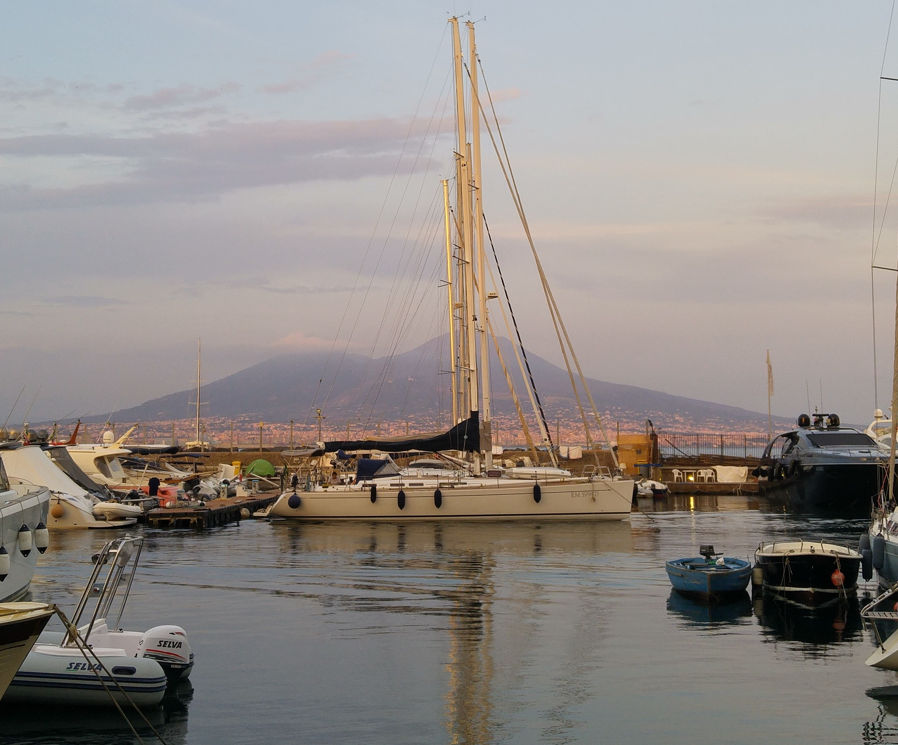
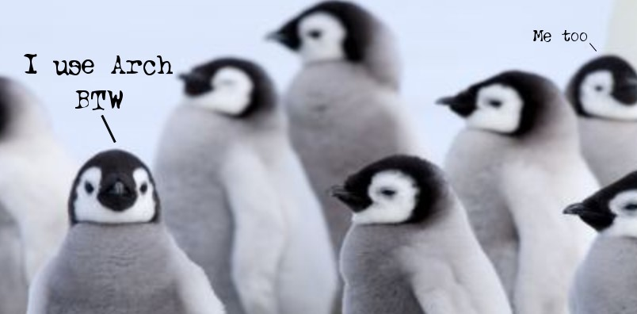

**Hello!**  
I'm glad you reached this page to know more about me.  
I'm Aldo, a 26-years old computer engineer who lives in Quarto, a city near [Naples, Italy](https://www.google.it/maps/place/Citt%C3%A0+Metropolitana+di+Napoli/@40.7775302,13.9804629,10z/data=!3m1!4b1!4m8!1m2!2m1!1snapoli!3m4!1s0x133b0a3c328d896b:0x309e11f99628150!8m2!3d40.901975!4d14.332644?hl=it).  

Although you may have guessed the computer engineer thing, I am passionate about all that's related to technology.  

More specifically I work into the **Embedded Systems** world, so I'm interested in all the stuff that usually a Javascript programmer is not aware of.  
(*No hard feelings, Javascript programmers!* 😛)  
I also have a passion for the open-source world and, as such, I have to struggle with Windows in my daily work.  
Luckily, I got *Arch Linux* to restore my soul.  

Apart from tech-related interests, I also like reading (although the time I spend on it is always not enough), with categories ranging from **Manga/Comics** to **Sci-Fi** and **Narrative**.  
I'm also passionate about **Music** and **Cinema**, and I like to find new TV series/movies to watch without actually finding time to do it (I'm getting better, *I swear*).  

But if I write all down here, you wouldn't have any reason to read my blog, don't you think? 😉

